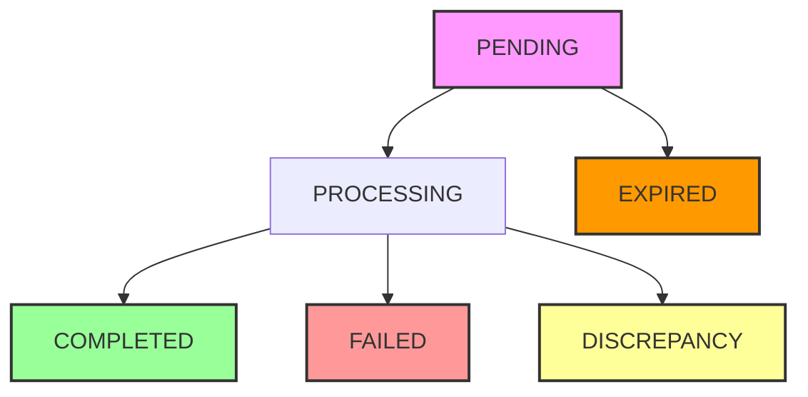

# Order System

This document covers the order lifecycle, status management, expiration system, and data structure.

## Order Status System

Orders follow a comprehensive lifecycle with automatic expiration:

### Order Statuses

- **`PENDING`**: Order created, waiting for payment
- **`PROCESSING`**: Payment initiated, transaction in progress
- **`COMPLETED`**: Payment successful, order fulfilled
- **`FAILED`**: Payment failed or refunded
- **`EXPIRED`**: Order expired without payment (after 5 minutes)
- **`DISCREPANCY`**: Payment bounced or validation issues

### Status Transition Flow



### Status Hierarchy

```typescript
const STATUS_HIERARCHY = {
  PENDING: 0,
  PROCESSING: 1,
  COMPLETED: 2,
  FAILED: 2,
  EXPIRED: 2,
  DISCREPANCY: 2,
};
```

## Order Expiration System

### Expiration Logic

- **Expiration Time**: 5 minutes from creation (`expired_at` field)
- **Automatic Processing**: Cron job runs every 5 minutes
- **Fallback Logic**: Orders without `expired_at` expire after 5 minutes from `created_at`
- **Status Transition**: Expired orders automatically become `EXPIRED`

### Expiration Implementation

```typescript
// Order creation with expiration
const now = new Date();
const expiresAt = new Date(now.getTime() + 5 * 60 * 1000); // +5 minutes

const orderToInsert = {
  // ... other fields
  created_at: now.toISOString(),
  expired_at: expiresAt.toISOString(),
  status: "PENDING",
};
```

### Cron Job Processing

```typescript
// Find expired orders
const now = new Date().toISOString();
const fiveMinutesAgo = new Date(Date.now() - 5 * 60 * 1000).toISOString();

const { data: expiredOrders } = await supabase
  .from("orders")
  .select("order_id, number, merchant_id, created_at, expired_at")
  .eq("status", "PENDING")
  .or(`expired_at.lt.${now},and(expired_at.is.null,created_at.lt.${fiveMinutesAgo})`);
```

## Order Data Structure

### Core Fields

- **`order_id`**: Unique identifier (UUID)
- **`merchant_id`**: Reference to merchant (UUID)
- **`payment_id`**: Daimo payment identifier
- **`number`**: Human-readable order number
- **`status`**: Current order status
- **`created_at`**: Order creation timestamp
- **`updated_at`**: Last update timestamp

### New Enhanced Fields

- **`expired_at`**: Timestamp when order expires
- **`payment_data`**: Complete Daimo payment response (jsonb)
- **`required_amount_usd`**: USD amount after currency conversion
- **`merchant_chain_id`**: Blockchain network for payment
- **`merchant_address`**: Merchant wallet address
- **`required_token`**: Token address for payment
- **`preferred_token_id`**: User's preferred payment token (optional)

### Payment Integration Fields

- **`display_currency`**: Currency shown to customer
- **`display_amount`**: Amount shown to customer
- **`description`**: Order description
- **`redirect_uri`**: Post-payment redirect URL
- **`preferred_token_id`**: User's preferred payment token (optional)

### Webhook Processing Fields

- **`callback_payload`**: Complete webhook data (jsonb)
- **`source_txn_hash`**: Source transaction hash
- **`source_chain_name`**: Source blockchain
- **`source_token_address`**: Source token address
- **`source_token_amount`**: Source token amount

## Order Creation Process

### Step-by-Step Flow

1. **Merchant Validation**: Verify merchant exists and is active
2. **Currency Conversion**: Convert display currency to USD using cache
3. **Token Resolution**: Resolve destination and preferred tokens
4. **Order Number Generation**: Generate unique order number
5. **Payment Link Creation**: Create Daimo payment link with token preferences
6. **Database Insertion**: Save order with expiration timestamp and preferred token
7. **Response Generation**: Return order details and QR code

### Performance Optimizations

```typescript
// Modular function structure
async function createOrder(supabase, userProviderId, isPrivyAuth, orderData) {
  const startTime = Date.now();
  
  // Step 1: Validate merchant
  const merchantResult = await validateMerchant(supabase, userProviderId, isPrivyAuth);
  if (!merchantResult.success) return merchantResult;

  // Step 2: Convert currency using cache
  const conversionResult = await convertCurrencyToUSD(
    supabase, orderData.display_currency, orderData.display_amount
  );
  if (!conversionResult.success) return conversionResult;

  // Step 3: Resolve tokens (destination from merchant default, preferred from user)
  const destinationTokenResult = await resolvePreferredToken(
    supabase, merchantResult.merchant.default_token_id
  );
  if (!destinationTokenResult.success) return destinationTokenResult;

  const preferredTokenResult = await resolvePreferredToken(
    supabase, merchantResult.merchant.default_token_id, orderData.preferred_token_id
  );
  if (!preferredTokenResult.success) return preferredTokenResult;

  // Step 4: Generate order number
  const orderNumber = generateOrderNumber();

  // Step 5: Create payment link with token preferences
  const paymentResult = await createPaymentLink(
    merchantResult.merchant, orderData, orderNumber, conversionResult.usdAmount,
    destinationTokenResult.token, preferredTokenResult.token
  );
  if (!paymentResult.success) return paymentResult;

  // Step 6: Insert order record
  const insertResult = await insertOrderRecord(
    supabase, orderData, merchantResult.merchant, orderNumber,
    paymentResult.paymentDetail, conversionResult.usdAmount, destinationTokenResult.token
  );
  if (!insertResult.success) return insertResult;

  // Log performance metrics
  const processingTime = Date.now() - startTime;
  console.log(`Order creation completed in ${processingTime}ms for order ${orderNumber}`);

  return {
    success: true,
    paymentDetail: paymentResult.paymentDetail,
    order_id: insertResult.order.order_id,
    order_number: insertResult.order.number,
  };
}
```

## Order Retrieval

### Single Order

```typescript
// Get single order by ID
const { data: order } = await supabase
  .from("orders")
  .select("*")
  .eq("order_id", orderId)
  .eq("merchant_id", merchant.merchant_id)
  .single();
```

### Order List with Pagination

```typescript
// Get orders with pagination and filtering
const { data: orders } = await supabase
  .from("orders")
  .select("*")
  .eq("merchant_id", merchant.merchant_id)
  .order("created_at", { ascending: false })
  .range(offset, offset + limit - 1);
```

### Status Filtering

```typescript
// Filter by status
// Valid statuses: pending, completed, failed, expired, discrepancy
const applyStatusFilter = (query) => {
  if (!statusParam) return query;
  
  const status = statusParam.toLowerCase();
  return status === "pending"
    ? query.in("status", ["PENDING", "PROCESSING"])
    : query.eq("status", statusParam.toUpperCase());
};
```

## Payment Regeneration

### Regenerate Payment Link

The regenerate payment endpoint allows users to create a new payment link for existing PENDING orders, with optional preferred token changes.

#### Endpoint

```text
POST /functions/v1/orders/{order_id}/regenerate-payment
```

#### Request Body (Optional)

```typescript
interface RegeneratePaymentRequest {
  preferred_token_id?: string; // Optional: change preferred token
}
```

#### Usage Examples

##### 1. Regenerate with Original Token

```bash
POST /functions/v1/orders/{order_id}/regenerate-payment
# Empty body - uses original preferred_token_id
```

##### 2. Regenerate with New Token

```bash
POST /functions/v1/orders/{order_id}/regenerate-payment
Content-Type: application/json

{
  "preferred_token_id": "usdt-base"
}
```

##### 3. Regenerate with Merchant Default

```bash
POST /functions/v1/orders/{order_id}/regenerate-payment
Content-Type: application/json

{
  "preferred_token_id": null
}
```

#### Response

```typescript
interface RegeneratePaymentResponse {
  success: boolean;
  qrcode: string;           // New payment QR code URL
  order_id: string;         // Order ID
  message: string;          // Success message
  paymentDetail: object;    // New payment details
}
```

#### Implementation Logic

```typescript
async function regeneratePaymentLink(
  supabase, orderId, userProviderId, isPrivyAuth, newPreferredTokenId?
) {
  // Step 1: Validate merchant and get order
  const merchantResult = await validateMerchant(supabase, userProviderId, isPrivyAuth);
  
  // Step 2: Get order details
  const { data: order } = await supabase
    .from("orders")
    .select("*")
    .eq("order_id", orderId)
    .eq("merchant_id", merchantResult.merchant.merchant_id)
    .single();

  // Step 3: Validate order status (only PENDING orders)
  if (order.status !== "PENDING") {
    return { success: false, error: "Only PENDING orders can regenerate payment" };
  }

  // Step 4: Determine preferred token (new or original)
  const preferredTokenIdToUse = newPreferredTokenId !== undefined 
    ? newPreferredTokenId 
    : order.preferred_token_id;

  // Step 5: Resolve tokens
  const destinationTokenResult = await resolvePreferredToken(
    supabase, merchantResult.merchant.default_token_id
  );
  
  const preferredTokenResult = await resolvePreferredToken(
    supabase, merchantResult.merchant.default_token_id, preferredTokenIdToUse
  );

  // Step 6: Create new payment link
  const paymentResult = await createPaymentLink(
    merchantResult.merchant, orderData, order.number, order.required_amount_usd,
    destinationTokenResult.token, preferredTokenResult.token
  );

  // Step 7: Update order with new payment data and preferred token
  const { error: updateError } = await supabase
    .from("orders")
    .update({
      payment_id: paymentResult.paymentDetail.id,
      payment_data: paymentResult.paymentDetail,
      preferred_token_id: preferredTokenIdToUse, // Update if changed
      status: "PENDING",
      expired_at: new Date(Date.now() + 10 * 60 * 1000).toISOString(),
      updated_at: new Date().toISOString(),
    })
    .eq("order_id", orderId);

  return { success: true, paymentDetail: paymentResult.paymentDetail };
}
```

#### Business Rules

- **Status Restriction**: Only PENDING orders can regenerate payment
- **Token Validation**: New preferred_token_id must exist in tokens table
- **Fallback Logic**: If no new token provided, uses original order's preferred_token_id
- **Database Update**: Updates order's preferred_token_id if changed
- **Expiration Reset**: Sets new 10-minute expiration timer
- **Payment Reset**: Generates completely new payment link

## Preferred Token System

### Token Resolution Logic

The system supports flexible token selection for both destination (where payment goes) and preferred (user's payment method) tokens.

#### Token Types

- **Destination Token**: Always uses merchant's `default_token_id` (where payment is received)
- **Preferred Token**: Uses user's `preferred_token_id` or falls back to merchant's `default_token_id`

#### Resolution Process

```typescript
async function resolvePreferredToken(
  supabase, merchantDefaultTokenId, userPreferredTokenId?
): Promise<{ success: boolean; token?: TokenData; error?: string }> {
  const tokenIdToUse = userPreferredTokenId || merchantDefaultTokenId;

  const { data: token, error: tokenError } = await supabase
    .from("tokens")
    .select("token_id, token_name, token_address, chain_id, chain_name")
    .eq("token_id", tokenIdToUse)
    .single();

  if (tokenError || !token) {
    return {
      success: false,
      error: userPreferredTokenId
        ? `Invalid preferred_token_id: Token not found`
        : `Merchant's default token not found`,
    };
  }

  return { success: true, token };
}
```

#### Payment Request Structure

```typescript
const paymentRequest = {
  destination: {
    chainId: destinationToken.chain_id,           // Merchant's default token
    tokenSymbol: destinationToken.token_name,     // Merchant's default token
    tokenAddress: destinationToken.token_address, // Merchant's default token
  },
  preferredChain: preferredToken.chain_id,                // User's choice or default
  preferredToken: preferredToken.token_name,              // User's choice or default
  preferredTokenAddress: preferredToken.token_address,    // User's choice or default
};
```

#### Usage Scenarios

##### 1. Order Creation with Default Token

```typescript
// Request body
{
  "display_currency": "USD",
  "display_amount": 100.00
  // No preferred_token_id - uses merchant's default
}

// Result:
// - Destination: merchant.default_token_id (e.g., USDC on Optimism)
// - Preferred: merchant.default_token_id (e.g., USDC on Optimism)
```

##### 2. Order Creation with Preferred Token

```typescript
// Request body
{
  "display_currency": "USD",
  "display_amount": 100.00,
  "preferred_token_id": "usdt-base"
}

// Result:
// - Destination: merchant.default_token_id (e.g., USDC on Optimism)
// - Preferred: "usdt-base" (USDT on Base)
```

##### 3. Regenerate Payment with Token Change

```typescript
// Request body
{
  "preferred_token_id": "dai-polygon"
}

// Result:
// - Destination: merchant.default_token_id (unchanged)
// - Preferred: "dai-polygon" (DAI on Polygon)
// - Order's preferred_token_id updated in database
```

#### Database Schema

```sql
-- Orders table
ALTER TABLE orders ADD COLUMN preferred_token_id text;
ALTER TABLE orders ADD CONSTRAINT orders_preferred_token_id_fkey 
  FOREIGN KEY (preferred_token_id) REFERENCES tokens(token_id);
CREATE INDEX orders_preferred_token_id_idx ON orders(preferred_token_id);

-- Tokens table structure
CREATE TABLE tokens (
  token_id text PRIMARY KEY,
  token_name text NOT NULL,        -- e.g., "USDC", "USDT", "DAI"
  token_address text NOT NULL,     -- Contract address
  chain_id text NOT NULL,          -- Chain ID
  chain_name text NOT NULL         -- Chain name
);
```

#### Validation Rules

- **Token Existence**: `preferred_token_id` must exist in `tokens` table
- **Merchant Default**: Falls back to merchant's `default_token_id` if not provided
- **Database Integrity**: Foreign key constraint ensures valid token IDs
- **Clear Errors**: Specific error messages for invalid tokens

## Webhook Processing

### Payment Status Updates

The `/payment-callback` function handles incoming webhooks from Daimo Pay:

```typescript
// Map webhook events to order status
function mapWebhookTypeToStatus(webhookType: string): PaymentStatus {
  switch (webhookType) {
    case "payment_started":
      return PaymentStatus.PROCESSING;
    case "payment.completed":
      return PaymentStatus.COMPLETED;
    case "payment_bounced":
      return PaymentStatus.DISCREPANCY;
    case "payment_refunded":
      return PaymentStatus.FAILED;
    default:
      throw new Error(`Unknown webhook type: ${webhookType}`);
  }
}
```

### Status Transition Validation

```typescript
// Prevent backward transitions
const currentStatusLevel = STATUS_HIERARCHY[currentStatus];
const newStatusLevel = STATUS_HIERARCHY[newStatus];

if (newStatusLevel < currentStatusLevel) {
  console.log(`Ignoring backward status transition from ${currentStatus} to ${newStatus}`);
  return Response.json("Status transition ignored", { status: 200 });
}
```

## Database Indexes

### Performance Optimization

```sql
-- Index for expiration queries
CREATE INDEX "orders_expired_at_idx" ON "public"."orders" USING "btree" ("expired_at");

-- Index for status + expiration queries
CREATE INDEX "orders_status_expired_idx" ON "public"."orders" USING "btree" ("status", "expired_at");

-- Index for order number lookups
CREATE INDEX "orders_number_idx" ON "public"."orders" USING "btree" ("number");

-- Index for preferred token queries
CREATE INDEX "orders_preferred_token_id_idx" ON "public"."orders" USING "btree" ("preferred_token_id");
```

## Error Handling

### Validation Errors

```typescript
// Amount validation
if (required_amount_usd < 0.1) {
  return {
    success: false,
    error: "Cannot create order with amount less than 0.1 USD",
  };
}

// Currency validation
if (error || !currency) {
  return {
    success: false,
    error: "Currency not found",
  };
}
```

### Database Errors

```typescript
// Order insertion error handling
if (orderError) {
  return {
    success: false,
    error: orderError.message,
  };
}
```

## Monitoring & Analytics

### Performance Metrics

- **Order Creation Time**: Logged for each order
- **Currency Conversion**: Cache hit rates tracked
- **Expiration Processing**: Cron job statistics
- **Status Transitions**: Webhook processing metrics

### Business Metrics

- **Order Volume**: Orders created per time period
- **Success Rate**: Percentage of completed orders
- **Expiration Rate**: Percentage of expired orders
- **Average Order Value**: Mean order amount in USD

## Best Practices

### Development

1. **Always Set Expiration**: Include `expired_at` for all new orders
2. **Validate Status Transitions**: Prevent invalid status changes
3. **Handle Edge Cases**: Account for orders without expiration dates
4. **Performance Monitoring**: Log timing for critical operations
5. **Error Handling**: Provide clear error messages
6. **Token Validation**: Always validate preferred_token_id exists before use
7. **Fallback Logic**: Implement proper fallback to merchant's default token

### Operations

1. **Monitor Expiration**: Track expired order rates
2. **Status Validation**: Ensure proper status transitions
3. **Performance Tracking**: Monitor order creation times
4. **Error Analysis**: Analyze failed order patterns
5. **Capacity Planning**: Monitor order volume trends
6. **Token Usage**: Monitor preferred token adoption rates
7. **Regeneration Metrics**: Track payment regeneration frequency
